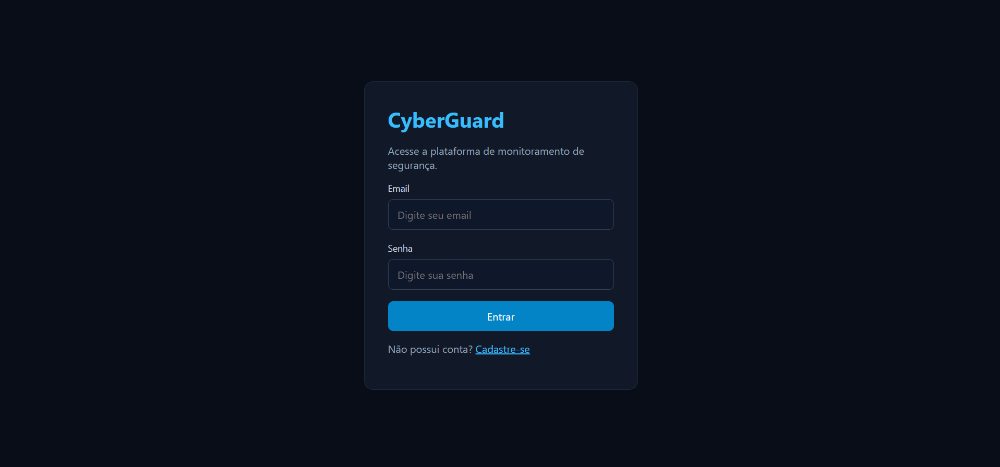
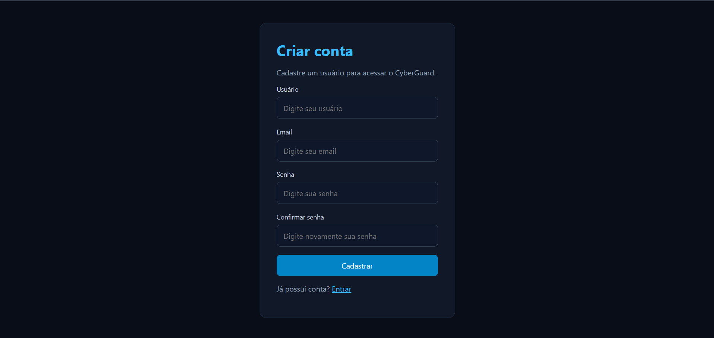
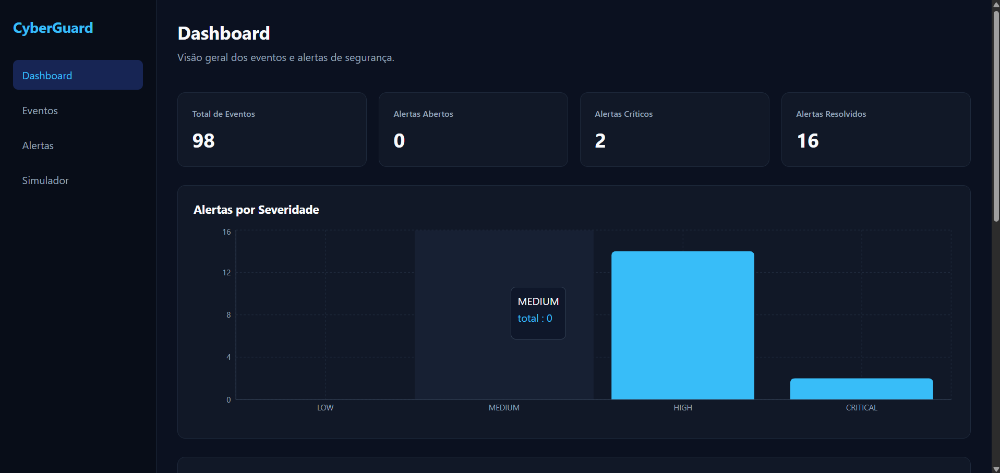
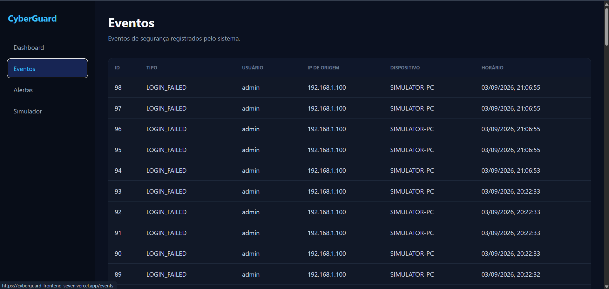
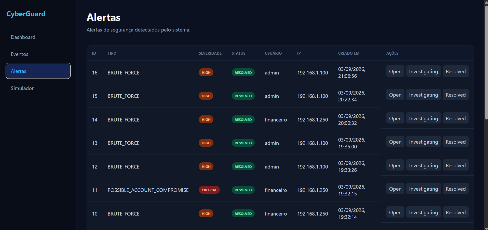
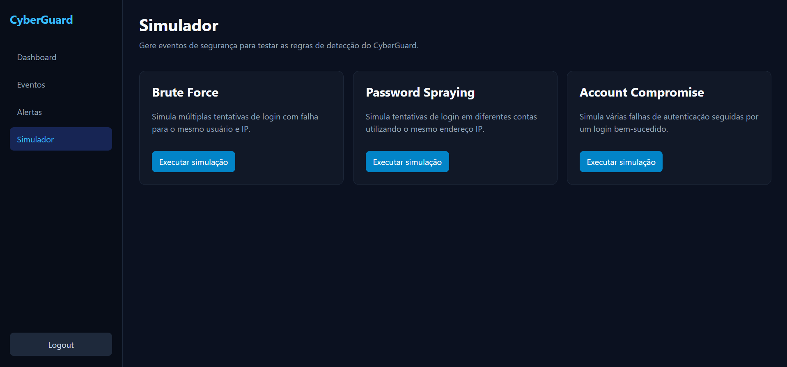

# CyberGuard — Front-end

Front-end do **CyberGuard**, uma aplicação web de monitoramento de segurança que permite visualizar eventos de autenticação, acompanhar alertas de possíveis ameaças e simular cenários de ataques para demonstrar o funcionamento do mecanismo de detecção.


> **Backend:** [cyberguard-backend](https://github.com/pedrogda/cyberguard-backend) — desenvolvido em Java com Spring Boot.  
> **Deploy:** [cyberguard-frontend](https://cyberguard-frontend-seven.vercel.app/login)  
> **API:** [CyberGuard API](https://cyberguard-backend-hqaj.onrender.com)  
> **Documentação:** [Swagger UI](https://cyberguard-backend-hqaj.onrender.com/swagger-ui/index.html)

---

O **CyberGuard** possui uma interface web desenvolvida para facilitar a visualização e interação com os dados de segurança processados pelo backend.

A aplicação permite que usuários autenticados acompanhem **eventos de segurança**, visualizem e gerenciem **alertas**, além de executarem **simulações de ataques** como Brute Force, Password Spraying e Possible Account Compromise.

O frontend se comunica com uma API REST desenvolvida em Spring Boot e utiliza autenticação baseada em **JWT** para acessar as rotas protegidas.

---

## Tecnologias Utilizadas

| | |
| --- | --- |
| React | JavaScript |
| Vite | React Router DOM |
| Axios | JWT |
| HTML | CSS |
| REST API | Vercel |

---

## Acesso para Teste

Um usuário está disponível para testar a aplicação publicada:

```text
Email: pedro@email.com
Senha: 123456
```

Acesse:

```text
https://cyberguard-frontend-seven.vercel.app/login
```

Informe as credenciais acima e realize o login.

> A conta é destinada apenas à demonstração e aos testes do CyberGuard.

---

## Funcionalidades

### Autenticação

- Login de usuários
- Cadastro de novos usuários
- Autenticação utilizando JWT
- Armazenamento do token de autenticação
- Controle de rotas protegidas
- Redirecionamento de usuários não autenticados
- Logout com remoção do token

### Dashboard

O Dashboard apresenta uma visão geral das informações de segurança registradas pelo CyberGuard.

A página permite acompanhar de forma centralizada os principais dados relacionados aos eventos e alertas do sistema.

### Eventos

A página de eventos permite acompanhar as atividades de autenticação registradas pelo backend.

Cada evento apresenta informações como:

- tipo do evento
- usuário
- endereço IP
- dispositivo
- data e horário

Entre os tipos de evento utilizados pelo sistema estão:

```text
LOGIN_FAILED
LOGIN_SUCCESS
```

Os eventos são apresentados do mais recente para o mais antigo.

### Alertas

A página de alertas permite acompanhar comportamentos suspeitos identificados pelo mecanismo de detecção do CyberGuard.

Entre os tipos de alerta estão:

```text
BRUTE_FORCE
PASSWORD_SPRAYING
POSSIBLE_ACCOUNT_COMPROMISE
```

Cada alerta apresenta informações como:

- tipo
- severidade
- status
- usuário
- endereço IP
- data e horário

O usuário também pode alterar o status dos alertas diretamente pela interface.

### Simulador

O CyberGuard possui uma interface de simulação utilizada para gerar eventos e demonstrar o funcionamento das regras de detecção.

Os cenários disponíveis incluem:

- **Brute Force**
- **Password Spraying**
- **Possible Account Compromise**

Ao executar uma simulação, o frontend envia uma requisição para o backend, que gera os eventos correspondentes e executa automaticamente as regras de detecção.

Os eventos e alertas resultantes podem ser visualizados nas respectivas páginas da aplicação.

---

## Interface da Aplicação

### Login

Tela utilizada para autenticação dos usuários através de email e senha.



### Cadastro

Tela para criação de uma nova conta no CyberGuard.



### Dashboard

Visão geral das informações de segurança registradas pela aplicação.



### Eventos de Segurança

Visualização dos eventos de autenticação registrados pelo CyberGuard.



### Alertas

Visualização e gerenciamento dos alertas gerados pelo mecanismo de detecção.



### Simulador

Interface utilizada para executar os cenários simulados de segurança.



> As imagens devem ser adicionadas à pasta `docs/` do repositório utilizando os nomes indicados acima.

---

## Detecções de Segurança

As regras de detecção são processadas pelo backend. O frontend é responsável por iniciar simulações e apresentar os resultados ao usuário.

### Brute Force

Representa diversas tentativas de login malsucedidas realizadas contra o mesmo usuário a partir do mesmo endereço IP.

### Password Spraying

Representa tentativas de autenticação realizadas pelo mesmo endereço IP contra diferentes usuários.

### Possible Account Compromise

Representa uma situação em que diversas tentativas malsucedidas são seguidas por uma autenticação bem-sucedida para o mesmo usuário e endereço IP.

---

## Integração com o Backend

A comunicação com a API REST é centralizada em:

```text
src/services/api.js
```

A URL da API é definida através da variável de ambiente:

```env
VITE_API_URL=https://cyberguard-backend-hqaj.onrender.com/api
```

Exemplo simplificado da configuração:

```javascript
import axios from "axios";

const api = axios.create({
    baseURL: import.meta.env.VITE_API_URL
});

export default api;
```

Essa abordagem permite utilizar diferentes endereços da API nos ambientes de desenvolvimento e produção.

As requisições para endpoints protegidos utilizam o token JWT:

```text
Authorization: Bearer <token>
```

---

## Principais Endpoints Consumidos

Como a variável `VITE_API_URL` já possui `/api`, os caminhos utilizados pelo frontend partem diretamente dos recursos abaixo.

### Autenticação

| Método | Endpoint | Descrição |
| --- | --- | --- |
| `POST` | `/auth/login` | Realiza login e retorna um token JWT |
| `POST` | `/auth/register` | Registra um novo usuário |

### Eventos

| Método | Endpoint | Descrição |
| --- | --- | --- |
| `GET` | `/events` | Lista os eventos de segurança |
| `POST` | `/events` | Registra um evento de segurança |

### Alertas

| Método | Endpoint | Descrição |
| --- | --- | --- |
| `GET` | `/alerts` | Lista os alertas de segurança |
| `PATCH` | `/alerts/:id/status` | Atualiza o status de um alerta |

### Simulador

| Método | Endpoint | Descrição |
| --- | --- | --- |
| `POST` | `/simulator/brute-force` | Simula um ataque de Brute Force |
| `POST` | `/simulator/password-spraying` | Simula Password Spraying |
| `POST` | `/simulator/account-compromise` | Simula possível comprometimento de conta |

---

## Estrutura do Projeto

O frontend é organizado separando páginas, componentes e serviços:

```text
src/
├── components/
├── pages/
├── services/
│   └── api.js
├── App.jsx
└── main.jsx
```

| Diretório / Arquivo | Responsabilidade |
| --- | --- |
| `components` | Componentes reutilizáveis da interface |
| `pages` | Principais páginas da aplicação |
| `services` | Comunicação com a API |
| `services/api.js` | Configuração central do Axios |
| `App.jsx` | Rotas e estrutura principal da aplicação |
| `main.jsx` | Ponto de entrada da aplicação React |

---

## Principais Páginas

### Login

Responsável pela autenticação do usuário.

- recebe email e senha
- envia as credenciais para o backend
- recebe o token JWT
- armazena o token
- redireciona o usuário após a autenticação

### Cadastro

Permite registrar um novo usuário no CyberGuard.

### Dashboard

Apresenta uma visão geral das informações de segurança.

### Eventos

Consulta e apresenta os eventos de autenticação registrados no sistema.

### Alertas

Apresenta os alertas gerados pelo mecanismo de detecção e permite gerenciar seus status.

### Simulador

Permite executar cenários simulados para demonstrar o funcionamento das regras de segurança.

---

## Fluxo de Autenticação

1. O usuário acessa a aplicação.
2. Caso não esteja autenticado, é direcionado para a tela de login.
3. O usuário informa email e senha.
4. O frontend envia as credenciais para o backend.
5. O backend valida as credenciais.
6. Um token JWT é retornado.
7. O frontend armazena o token.
8. O usuário passa a ter acesso às rotas protegidas.
9. As requisições seguintes enviam o JWT para o backend.
10. Ao realizar logout, o token é removido.

Fluxo simplificado:

```text
Usuário
   │
   │ Email + Senha
   ▼
Frontend
   │
   │ POST /auth/login
   ▼
Backend
   │
   │ Validação
   ▼
JWT
   │
   ▼
Frontend
   │
   ▼
Rotas Protegidas
```

---

## Fluxo de Detecção

As regras de segurança são executadas pelo backend.

```text
Simulador
    │
    ▼
Frontend
    │
    │ REST API
    ▼
Backend
    │
    ▼
DetectionService
    │
    ├── Brute Force
    ├── Password Spraying
    └── Possible Account Compromise
    │
    ▼
Eventos + Alertas
    │
    ▼
PostgreSQL
    │
    ▼
Frontend
```

O processo ocorre da seguinte maneira:

1. O usuário executa uma simulação.
2. O frontend envia a requisição para o backend.
3. O backend gera os eventos correspondentes.
4. O mecanismo de detecção analisa os eventos.
5. Caso alguma regra seja satisfeita, um alerta é criado.
6. Eventos e alertas são armazenados no PostgreSQL.
7. O frontend consulta os novos dados.
8. As informações são apresentadas ao usuário.

---

## Fluxo de Alertas

1. O frontend solicita os alertas através de `GET /alerts`.
2. O backend retorna os alertas registrados.
3. Os alertas são apresentados na interface.
4. O usuário pode analisar o tipo, severidade e origem do alerta.
5. O status pode ser alterado.
6. O frontend envia `PATCH /alerts/:id/status`.
7. A interface é atualizada com o novo status.

---

## Datas e Horários

Os timestamps recebidos do backend são padronizados em UTC.

Exemplo:

```text
2026-09-03T23:12:50.019370Z
```

O frontend converte esses valores para apresentação no horário adequado ao usuário.

Isso mantém os dados consistentes entre:

- navegador
- frontend hospedado na Vercel
- backend hospedado no Render
- PostgreSQL hospedado no Supabase

---

## Variáveis de Ambiente

O frontend utiliza uma variável de ambiente para definir o endereço da API.

### Produção

```env
VITE_API_URL=https://cyberguard-backend-hqaj.onrender.com/api
```

### Desenvolvimento local

Caso o backend esteja rodando localmente:

```env
VITE_API_URL=http://localhost:3000/api
```

O arquivo `.env` não deve ser enviado para o GitHub.

O `.gitignore` deve conter:

```text
.env
.env.*
```

> Variáveis iniciadas com `VITE_` ficam disponíveis para o código executado no navegador. Portanto, senhas, `JWT_SECRET`, credenciais do banco de dados e outras informações secretas nunca devem ser armazenadas nessas variáveis.

---

## Deploy

O frontend está hospedado na **Vercel**:

https://cyberguard-frontend-seven.vercel.app/login

O backend utilizado pela aplicação está hospedado no **Render**:

https://cyberguard-backend-hqaj.onrender.com

O banco PostgreSQL está hospedado no **Supabase**.

### Arquitetura em Produção

```text
Usuário
   │
   ▼
React + Vite
Vercel
   │
   │ HTTPS / JWT
   ▼
Spring Boot
Render
   │
   │ JDBC
   ▼
PostgreSQL
Supabase
```

O backend possui configuração de CORS para permitir as requisições originadas pelo frontend publicado na Vercel.

---

## Como Rodar o Projeto

### Pré-requisitos

- Node.js
- npm
- Backend do CyberGuard em execução

O backend pode ser encontrado em:

https://github.com/pedrogda/cyberguard-backend

### 1. Clonar o repositório

```bash
git clone https://github.com/pedrogda/cyberguard-frontend.git
```

### 2. Acessar a pasta do projeto

```bash
cd cyberguard-frontend
```

### 3. Instalar as dependências

```bash
npm install
```

### 4. Configurar a API

Crie um arquivo `.env` na raiz do projeto.

Para utilizar o backend publicado:

```env
VITE_API_URL=https://cyberguard-backend-hqaj.onrender.com/api
```

Ou, caso esteja executando o backend localmente:

```env
VITE_API_URL=http://localhost:3000/api
```

### 5. Executar em ambiente de desenvolvimento

```bash
npm run dev
```

A aplicação será iniciada em:

```text
http://localhost:5173
```

---

## Scripts Disponíveis

| Comando | Descrição |
| --- | --- |
| `npm run dev` | Inicia o servidor de desenvolvimento |
| `npm run build` | Gera a versão otimizada para produção |
| `npm run preview` | Executa uma prévia local da build de produção |
| `npm run lint` | Executa o ESLint no projeto |

---

## Backend

O backend do CyberGuard possui seu próprio repositório:

https://github.com/pedrogda/cyberguard-backend

A documentação interativa da API está disponível através do Swagger:

https://cyberguard-backend-hqaj.onrender.com/swagger-ui/index.html

---

## Objetivo do Projeto

O frontend do CyberGuard foi desenvolvido como parte de um projeto full-stack de portfólio, aplicando conceitos de:

- desenvolvimento com React
- Single Page Applications
- componentização
- gerenciamento de estado
- consumo de APIs REST
- autenticação JWT
- rotas protegidas
- integração frontend/backend
- tratamento e apresentação de dados
- variáveis de ambiente
- integração com Spring Boot
- deploy com Vercel

O CyberGuard utiliza eventos simulados para demonstrar conceitos de monitoramento e detecção de segurança.

A aplicação não realiza monitoramento real de dispositivos ou redes e não substitui ferramentas profissionais de **SIEM, SOC ou EDR**.

---

## Repositórios

**Frontend:**  
https://github.com/pedrogda/cyberguard-frontend

**Backend:**  
https://github.com/pedrogda/cyberguard-backend

---

## Autor

Desenvolvido por **Pedro Augusto Gomes de Araújo**.

GitHub: https://github.com/pedrogda
